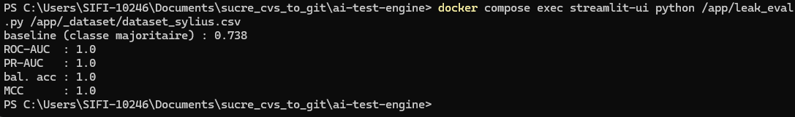
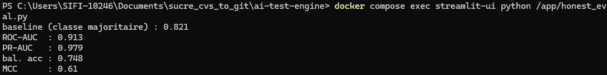
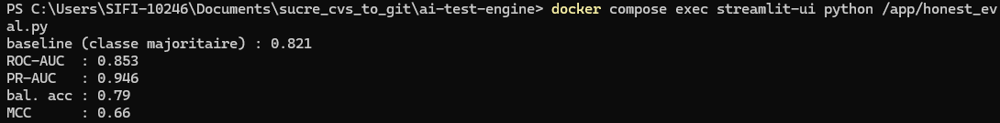
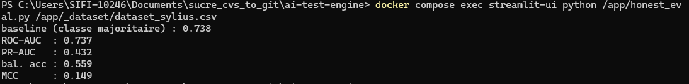

# Prédicteur de risque de régression — Validation méthodologique du modèle supervisé

## Introduction

L'objectif de cet axe était d'entraîner un classifieur capable d'estimer le
risque de régression d'une méthode de controller Symfony, afin de prioriser la
génération de tests. Le label de risque est un proxy issu de l'historique git,
selon la méthodologie classique du *software defect prediction*
(Hassan 2009 ; Kamei et al. 2013) : une unité est dite « à risque » lorsque le
fichier qui la contient a été touché par au moins *N* commits de correction
(`fix:`, `hotfix`, `correctif`…) sur une fenêtre de douze mois (seuil retenu :
N = 2).

Les features combinent des métriques **structurelles** extraites par le parser
PHP partagé avec l'AI Test Engine (complexité cyclomatique, nombre de lignes,
dépendances injectées, nombre de méthodes de la classe, attributs de route,
contrôles de voter, types de réponse, etc.) et des métriques **git** au niveau
fichier (nombre de commits, nombre d'auteurs, ancienneté du dernier changement,
nombre de commits de bugfix). Le protocole initial reposait sur une comparaison
de trois familles de modèles (LogisticRegression, RandomForest, XGBoost) via une
validation croisée `RepeatedStratifiedKFold` (5 plis × 3 répétitions) et un split
de test 80/20 stratifié aléatoire.

## Fausses pistes et constats erronés

La première itération a produit des scores anormalement élevés, interprétés à
tort comme un signe de qualité du modèle :

- RandomForest annoncé « meilleur modèle » avec une **accuracy de 99,1 %**, un
  **F1 (CV) de 0,986** et surtout un **AUC-ROC de 1,000** ;
- une matrice de confusion présentant **zéro faux positif** et un seul faux
  négatif ;
- un écart d'overfitting jugé « faible » (0,0032), renforçant la fausse
  impression de robustesse.

La reproduction manuelle de cette condition (toutes les features git conservées,
dont `git_bugfix_count`, et validation croisée à découpage aléatoire) porte
*l'ensemble* des indicateurs à leur valeur maximale.

*Figure 0 — Condition initiale reproduite sur Sylius : ROC-AUC, PR-AUC, balanced
accuracy et MCC tous égaux à 1,000. La perfection simultanée de tous les
indicateurs, y compris ceux insensibles au déséquilibre (MCC, balanced accuracy),
est la signature caractéristique d'une fuite de cible et non d'un modèle
performant.*

Une vérification de la corrélation linéaire entre features et label a un temps
semblé écarter la fuite : sur SUCRE, `git_bugfix_count` ne corrélait qu'à 0,51
avec le label, valeur jugée modérée et rassurante. Cette lecture était erronée
(voir Analyse).

## Résultats observés

L'examen du code d'extraction a révélé que le label est défini par
`label_risk = (git_bugfix_count >= 2)`, alors même que `git_bugfix_count`
figurait dans la liste des features. Le label est donc une fonction déterministe
et seuillée d'une feature fournie au modèle.

Plusieurs comportements incohérents ont alors été reliés à cette cause :

- l'AUC parfait et l'absence de faux positifs s'expliquent par un simple seuil de
  décision sur une variable qui *est* le label ;
- les deux jeux de données `dataset_akeneo` et `dataset_demo` étaient
  **mono-classe** (100 % de la classe 0), rendant tout AUC indéfini ;
- la balance de classe sur disque pour Sylius (74 % / 26 %) ne correspondait pas
  à celle implicite dans la matrice de confusion du tableau de bord, signe que ce
  dernier reposait sur des données ou un entraînement obsolètes ;
- de nombreuses features étaient constantes (corrélation `NaN`) sur Sylius et
  Akeneo.

## Analyse

Trois mécanismes de fuite distincts ont été identifiés, par ordre de gravité.

**1. Fuite directe de la cible.** Le label étant `git_bugfix_count >= 2`, la
présence de `git_bugfix_count` (et de `git_total_commits`, qui le contient) parmi
les features revient à donner la réponse au modèle. La corrélation de Pearson de
0,51 observée précédemment ne contredit pas ce diagnostic : la corrélation
linéaire entre un compteur et sa version seuillée n'atteint jamais 1, alors qu'un
arbre de décision exploite parfaitement le seuil. Une faible corrélation linéaire
ne garantit donc pas l'absence de fuite.

**2. Fuite de groupe.** Le dataset comporte une ligne par couple
(controller, méthode), tandis que les métriques git et le label sont calculés au
niveau du fichier. Toutes les méthodes d'un même controller partagent donc des
features git et un label identiques. Avec un split aléatoire, des méthodes d'un
même fichier se retrouvent à la fois en apprentissage et en test : le modèle
reconnaît la signature du fichier plutôt qu'il ne généralise. Les « 183
observations » ne constituent pas autant d'unités indépendantes.

**3. Fuite temporelle (contemporaine).** Les métriques git restantes
(`git_nb_authors`, `git_days_since_change`) sont mesurées sur la même fenêtre de
douze mois que le label. Un fichier souvent corrigé y présente mécaniquement plus
d'auteurs et un changement plus récent ; ces variables restent donc des proxies
contemporains du label.

**Un quatrième écueil, non lié à une fuite, est apparu à l'évaluation finale : le
critère de sélection du modèle.** Choisir « le meilleur modèle » sur le F1 favorise
mécaniquement celui qui colle à la classe majoritaire (82 % de positifs), soit le
RandomForest. Or sur les métriques robustes au déséquilibre (balanced accuracy,
MCC), c'est la régression logistique qui domine. Le F1 est donc un critère de
sélection trompeur en contexte déséquilibré ; le MCC a été retenu à la place.

## Conclusions tirées

Les métriques initiales ne reflétaient pas une capacité prédictive mais une
contamination du jeu d'apprentissage. Toute évaluation devait donc être refaite
en (a) retirant les features dérivées de l'historique de bugfix, (b) remplaçant
le split aléatoire par une validation `GroupKFold` regroupée par fichier, et
(c) écartant les jeux mono-classe. Les métriques d'accuracy et de PR-AUC devaient
en outre être interprétées relativement aux références adéquates : taux de la
classe majoritaire pour l'accuracy, prévalence de la classe positive pour la
PR-AUC.

## Réalisation

Une première vérification exploratoire a été menée à la main dans le conteneur,
avec un RandomForest (`class_weight=balanced`) et une validation `GroupKFold` à 5
plis regroupée par fichier. Trois configurations ont été comparées sur SUCRE, puis
le modèle structurel a été évalué sur Sylius.

| Configuration | Référence | ROC-AUC | PR-AUC | Balanced acc. | MCC |
|---|---|---|---|---|---|
| SUCRE — protocole initial (fuite) | 0,821 | 1,000 | — | — | — |
| SUCRE — features git de bugfix retirées + GroupKFold | 0,821 | 0,913 | 0,979 | 0,748 | 0,61 |
| SUCRE — features structurelles seules (toutes features git retirées) | 0,821 | 0,853 | 0,946 | **0,79** | **0,66** |
| Sylius — features structurelles seules | 0,738 | 0,737 | 0,432 | 0,559 | 0,149 |

Les exécutions ont été réalisées manuellement dans le conteneur, via un script
d'évaluation dédié appliquant `GroupKFold` regroupée par fichier.

*Figure 1 — SUCRE après retrait de `git_bugfix_count` et `git_total_commits` et
passage en `GroupKFold` par fichier : ROC-AUC 0,913, PR-AUC 0,979, balanced
accuracy 0,748, MCC 0,61 (référence classe majoritaire : 0,821).*

*Figure 2 — SUCRE, toutes les features git retirées (structure du code
uniquement) : ROC-AUC 0,853, PR-AUC 0,946, balanced accuracy 0,79, MCC 0,66. La
balanced accuracy et le MCC progressent malgré le retrait des métriques git.*

*Figure 3 — Sylius, mêmes features structurelles : ROC-AUC 0,737, PR-AUC 0,432,
balanced accuracy 0,559, MCC 0,149 (référence classe majoritaire : 0,738). La
performance s'effondre, le routing et la sécurité de Sylius étant déclarés en
YAML hors du code.*

Deux enseignements ressortent. D'une part, le retrait *complet* des features git
ne fait perdre que 0,06 d'AUC sur SUCRE, tout en améliorant la balanced accuracy
et le MCC : la capacité prédictive repose donc bien sur la **structure du code**,
et non sur la fuite résiduelle. Le modèle retenu pour le déploiement est par
conséquent le modèle **structurel seul**, plus simple et sans dépendance à une
fenêtre temporelle.

D'autre part, ce même modèle s'effondre sur Sylius (balanced accuracy 0,559, MCC
0,149). L'explication tient à la nature de Sylius, qui déclare son routing et sa
sécurité en YAML hors du code : les features d'annotation (`has_route_attr`,
`nb_voter_checks`, `nb_*_grants`…) y sont constantes et n'apportent aucun signal.
L'extracteur est donc adapté aux projets Symfony **annotés dans le code**, dont
SUCRE fait partie.

### Pipeline de production et sélection finale

Le pipeline `train.py` a ensuite été corrigé en conséquence : split de test
`GroupShuffleSplit` et validation croisée `StratifiedGroupKFold`, tous deux
groupés par fichier, avec calcul de l'AUC, de la balanced accuracy et du MCC en
validation croisée (et non plus sur un unique holdout de quelques fichiers). Deux
jeux de features ont été comparés : v2 (15 features structurelles + churn git de
fenêtre) et v3 (13 features, structure pure, sans `git_nb_authors` ni
`git_days_since_change`).

| Jeu | Modèle | CV F1 | CV AUC | Balanced acc. | MCC | Gap CV |
|---|---|---|---|---|---|---|
| v2 | RandomForest | 0,917 | 0,904 | 0,707 | 0,480 | 0,081 |
| v2 | LogisticRegression | 0,831 | 0,853 | 0,766 | 0,522 | 0,089 |
| v2 | XGBoost | 0,828 | 0,817 | 0,714 | 0,400 | 0,080 |
| v3 | RandomForest | 0,903 | 0,879 | 0,720 | 0,475 | 0,082 |
| **v3** | **LogisticRegression** | 0,851 | 0,833 | **0,806** | **0,545** | **0,052** |
| v3 | XGBoost | 0,835 | 0,810 | 0,739 | 0,449 | 0,043 |

Le passage de v2 à v3 ne coûte que 0,025 d'AUC sur le RandomForest (dans
l'intervalle de confiance, ±0,10), pour un modèle désormais sans aucune dépendance
à la fenêtre temporelle du label. En sélectionnant sur le MCC plutôt que sur le
F1, le modèle retenu est la **régression logistique en v3** : meilleur MCC (0,545)
et meilleure balanced accuracy (0,806), plus faible sur-apprentissage (gap CV
0,052) et interprétabilité directe par ses coefficients. C'est ce modèle qui est
sérialisé dans `best_model.pkl`. (Les légers écarts avec la vérification
exploratoire ci-dessus tiennent aux estimateurs et hyperparamètres distincts, ainsi
qu'à l'AUC moyennée par pli plutôt que groupée.)

## Conclusion

La démarche a permis de passer d'un modèle apparemment parfait mais invalide
(AUC-ROC 1,000 par fuite de cible) à un modèle honnête et défendable : une
régression logistique sur features structurelles pures (v3), évaluée par
validation croisée groupée par fichier, atteignant un MCC de 0,545, une balanced
accuracy de 0,806 et une AUC-ROC de 0,833, sans aucune dépendance à la fenêtre
temporelle du label. La performance se dégradant fortement sur un projet à
configuration YAML, le domaine d'applicabilité du prédicteur est explicitement
borné aux codebases Symfony annotés dans le code, résultat cohérent avec la
difficulté connue de la prédiction de défauts inter-projets (Zimmermann et al.
2009).

**Limites.** Les features sont mesurées sur l'état courant du code (HEAD) alors
que le label couvre les douze mois écoulés : il s'agit donc d'une prédiction
rétrospective et non strictement *forward-looking*. Une version prédictive
rigoureuse imposerait un découpage temporel (features à *t₀*, label sur
[*t₀*, *t₁*]), à l'image des approches *Just-In-Time* (Kamei et al. 2013).
